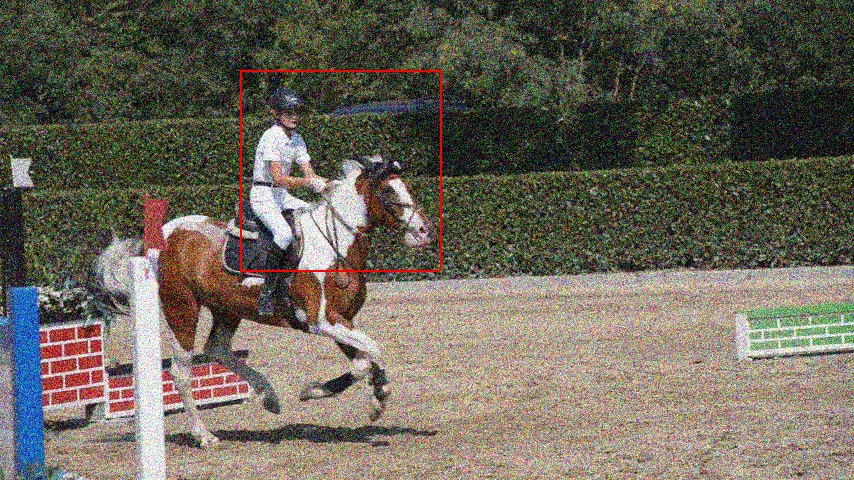
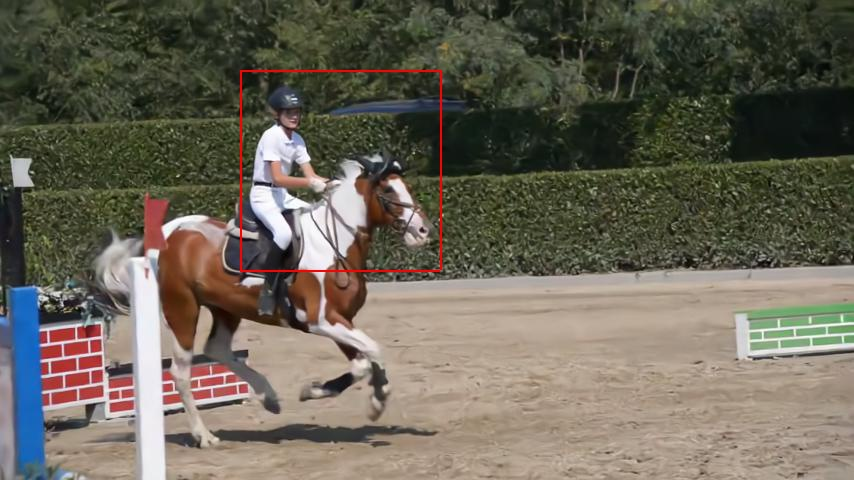
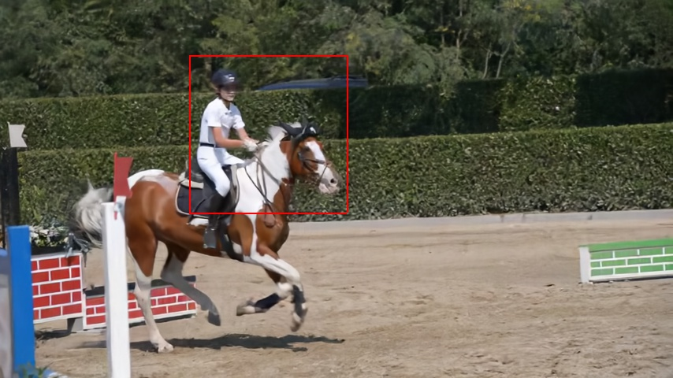
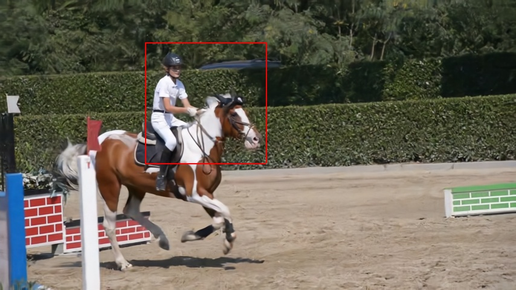
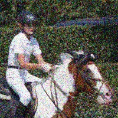
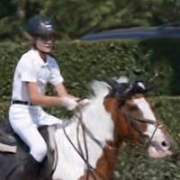
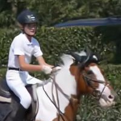
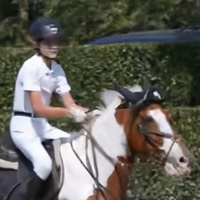
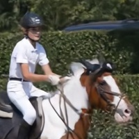

# PaCNet

[Arxiv](https://arxiv.org/pdf/2103.13767.pdf) | [CVF (pdf)](https://openaccess.thecvf.com/content/ICCV2021/papers/Vaksman_Patch_Craft_Video_Denoising_by_Deep_Modeling_and_Patch_Matching_ICCV_2021_paper.pdf) | [CVF (suppl)](https://openaccess.thecvf.com/content/ICCV2021/supplemental/Vaksman_Patch_Craft_Video_ICCV_2021_supplemental.pdf)
### Official PyTorch implementation of the paper: "Patch Craft: Video Denoising by Deep Modeling and Patch Matching."
####  ICCV 2021

## Overview
PaCNet (Patch-Craft Network) is a video and image denoiser.  
The link to the presentation of the paper is [here](https://www.youtube.com/watch?v=pgaklIne1lE).

  
&nbsp; &nbsp; &nbsp; &nbsp; &nbsp; &nbsp; &nbsp; &nbsp; &nbsp; noisy with &sigma; = 40 &nbsp; &nbsp; &nbsp; &nbsp; &nbsp; &nbsp; &nbsp; &nbsp; &nbsp; &nbsp; &nbsp; &nbsp; &nbsp; &nbsp; &nbsp; &nbsp; Filered with PaCNet &nbsp; &nbsp; &nbsp; &nbsp; &nbsp; &nbsp; &nbsp; &nbsp; &nbsp; &nbsp; &nbsp; &nbsp; &nbsp; &nbsp; &nbsp; &nbsp; &nbsp; &nbsp; &nbsp; Original

## Quantitative Results
Our S-CNN network works in a sliding window manner. In order to produce a reconstructed frame it loads seven noisy frames in the input – the corresponding noisy frame and three frames before and after it. In such a way, any frame enters the S-CNN network seven times, once as a processed frame and six more times as an auxiliary frame used for the nearest neighbor search. In simulations reported in the paper, we had a mistake in adding the noise. Instead of injecting noise to the whole video sequence before the processing, we added independent noise to each group of seven consecutive frames (after loading them from memory). In this scenario, each frame enters the network with seven different instantiations of noise, which makes the denoising process somewhat easier. We fixed this bug in the code, and that led to a small degradation of the results. The following tables contain both results: the one (too high) reported in the article and the more recent and correct one. In this repository, we publish both versions of the code: the new code after the bug fix and the old version that achieves a slightly higher PSNR.

### Gaussian denoising results on DAVIS test set

| Noise <br> Level | V-BM4D <br> [^1] | VNLB <br> [^2] | VNLnet <br> [^3] | DVDnet <br> [^4] | FastDVDnet <br> [^*] [^5] | PaCNet <br>(reported in <br>the paper) | PaCNet <br>(correct result) |
|:-------:|:-------:|:-------:|:-------:|:-------:|:-------:|:-------:|:-------:|
|   10        | 37.58 | 38.85 | 35.83 | 38.13 | 38.93 | ~~39.97~~ | **39.97** |
|   20        | 33.88 | 35.68 | 34.49 | 35.70 | 35.88 | ~~37.10~~ | **36.84** |
|   30        | 31.65 | 33.73 | -[^**] | 34.08 | 34.12 | ~~35.07~~ | **34.81** |
|   40        | 30.05 | 32.32 | 32.32 | 32.86 | 32.87 | ~~33.57~~ | **33.35** |
|   50        | 28.80 | 31.13 | 31.43 | 31.85 | 31.90 | ~~32.39~~ | **32.22** |
| **Average** | 32.39 | 34.34 | - | 34.52 | 34.74 | ~~35.62~~ | **35.44** |

Best PSNR marked in **bold**.  

### Denoising with clipped Gaussian noise on DAVIS test set

| Method | 10 | 30 | 50 | **Average** |
|:-------:|:-------:|:-------:|:-------:|:-------:|
| ViDeNN [^6] | 37.13 | 32.24 | 29.77 | 33.05 |
| FastDVDnet[^*] [^5] | 38.65 | 33.59 | 31.28 | 34.51 |
| PaCNet (reported in the paper) | ~~40.13~~ | ~~34.92~~ | ~~32.15~~ | ~~35.73~~ |
| PaCNet (correct result) | **39.96** | **34.66** | **32.00** | **35.54** |


Best PSNR marked in **bold**.

### Gaussian denoising results on Set8
| Method | 10 | 20 | 30 | 40 | 50 | **Average** |
|:-------:|:-------:|:-------:|:-------:|:-------:|:-------:|:-------:|
| DVDnet [^4] | 36.08 | 33.49 | 31.79 | 30.55 | 29.56 | 32.29 |
| FastDVDnet [^5] | 36.44 | 33.43 |  31.68 | 30.46 | 29.53 | 32.31 |
| PaCNet (ours) | 37.06 | 33.94 | 32.05 | 30.70 | 29.66 | 32.68 |

## Qualitative Results

  
  
   
&nbsp; &nbsp; &nbsp; &nbsp; &nbsp; clean &nbsp; &nbsp; &nbsp; &nbsp; &nbsp; &nbsp; &nbsp; noisy with &sigma; = 40 &nbsp; &nbsp; &nbsp; &nbsp; &nbsp; VNLB &nbsp; &nbsp; &nbsp; &nbsp; &nbsp; &nbsp; &nbsp; &nbsp; &nbsp; &nbsp; VNLnet &nbsp; &nbsp; &nbsp; &nbsp; &nbsp; &nbsp; &nbsp; &nbsp;FastDVDnet &nbsp; &nbsp; &nbsp; &nbsp; &nbsp; PaCNet (ours) 
<br /> &nbsp; &nbsp; &nbsp; &nbsp; &nbsp; &nbsp; &nbsp; &nbsp; &nbsp; &nbsp; &nbsp; &nbsp; &nbsp; &nbsp; &nbsp; &nbsp; &nbsp; &nbsp; &nbsp; &nbsp; &nbsp; &nbsp; &nbsp; &nbsp; &nbsp; &nbsp; &nbsp; &nbsp; &nbsp; &nbsp; &nbsp; &nbsp; PSNR = 28.66dB &nbsp; &nbsp; PSNR = 29.03dB &nbsp; PSNR = 29.27dB &nbsp; PSNR = 27.67dB 

  
  
   
&nbsp; &nbsp; &nbsp; &nbsp; &nbsp; clean &nbsp; &nbsp; &nbsp; &nbsp; &nbsp; &nbsp; &nbsp; noisy with &sigma; = 40 &nbsp; &nbsp; &nbsp; &nbsp; &nbsp; VNLB &nbsp; &nbsp; &nbsp; &nbsp; &nbsp; &nbsp; &nbsp; &nbsp; &nbsp; &nbsp; VNLnet &nbsp; &nbsp; &nbsp; &nbsp; &nbsp; &nbsp; &nbsp; &nbsp;FastDVDnet &nbsp; &nbsp; &nbsp; &nbsp; &nbsp; PaCNet (ours) 
<br /> &nbsp; &nbsp; &nbsp; &nbsp; &nbsp; &nbsp; &nbsp; &nbsp; &nbsp; &nbsp; &nbsp; &nbsp; &nbsp; &nbsp; &nbsp; &nbsp; &nbsp; &nbsp; &nbsp; &nbsp; &nbsp; &nbsp; &nbsp; &nbsp; &nbsp; &nbsp; &nbsp; &nbsp; &nbsp; &nbsp; &nbsp; &nbsp; PSNR = 27.92dB &nbsp; &nbsp; PSNR = 27.95dB &nbsp; PSNR = 28.23dB &nbsp; PSNR = 28.88dB

## PaCNet as Single Image Denoiser
PaCNet can be used as a single image denoiser. The following table reports the denoising performance of PaCNet, comparing it with the most similar image denoiser LIDIA [^7].

### Gaussian denoising results on BSD68 test set
| Method | 15 | 25 | 50 | **Average** |
|:-------:|:-------:|:-------:|:-------:|:-------:|
| LIDIA [^7] | 34.03 | 31.31 | 27.99 | 31.11 |
| PaCNet (ours) | 33.95 | 31.22 | 27.93 | 31.03 |

# Code
This code was tested with python TBD, cuda TBD and pytorch TBD on TBD.

## Requirements
- numpy
- opencv
- matplotlib
- torch

### Install dependencies:
``` 
python -m pip install -r code/requirements.txt
```

## Video Denoising

### Denoise a video sequence
```
python code/process_video_sequence.py --in_folder <in_folder> --file_ext <file_ext> --sigma <sigma> --clipped_noise <clipped_noise> [--save_jpg] --jpg_out_folder <jpg_out_folder> [--save_avi] --avi_out_folder <avi_out_folder> --gpu_usage <gpu_usage> [--plot]
```

#### Parameters
- **in_folder** - path to a test video sequence. Default: *./data_set/davis/horsejump-stick/*
- **file_ext** - file extension: {*jpg*, *png*}. Default: *jpg*
- **sigma** - noise sigma.<br>
              For AWGN: {*10*, *20*, *30*, *40*, *50*}. <br>
              For clipped Gaussian noise: {*10*, *30*, *50*} <br>
              Default: *20*
- **clipped_noise** - noise type: {*0* - AWGN, *1* - clipped Gaussian}
- **[--save_jpg]** (flag) - save the denoised video as JPG frames
- **jpg_out_folder** - path to folder for saving JPG frames. Default: *./output/videos/jpg_sequences/demo/*
- **[--save_avi]** (flag) - save the denoised video as AVI file
- **avi_out_folder** - path to folder for saving AVI file. Default: *./output/videos/avi_files/demo/*
- **gpu_usage** - GPU usage: <br>
                  0 - use CPU, <br>
                  1 - use GPU for nearest neighbor search, <br>
                  2 - use GPU for whole processing (requires large GPU memory)
- **[--plot]** (flag) - plot a frame from the processed video sequence

#### For demo run
```
python code/process_video_sequence.py --gpu_usage 1 --save_jpg --save_avi --plot
```

#### For denoising a video sequence in your code call *denoise_video_sequence* function
```
denoise_video_sequence(<noisy_vid>, <vid_name>, <sigma>, [clipped_noise], [gpu_usage], [silent])
```

#### Parameters
- **noisy_vid** (required) - noisy video sequence
- **vid_name** (required) - video name
- **sigma** (required) - noise sigma. <br>
  For AWGN: {*10*, *20*, *30*, *40*, *50*} <br>
  For Clipped Gaussian noise: {*10*, *30*, *50*}
- **clipped_noise** (optional) - ***0*** - AWGN, *1* - clipped Gaussian noise
- **gpu_usage** (optional) - GPU usage: <br>
                ***0*** - use CPU, <br>
                1 - use GPU for nearest neighbor search, <br>
                2 - use GPU for whole processing (requires large GPU memory)

#### Outputs:
- **denoised_vid** - denoised video sequence
- **denoising_time** - denoising time 

### Denoise a video set
```
python code/process_video_sequence.py --in_folder <in_folder> --file_ext <file_ext> --sigma <sigma> --clipped_noise <clipped_noise> [--save_jpg] --jpg_out_folder <jpg_out_folder> [--save_avi] --avi_out_folder <avi_out_folder> --gpu_usage <gpu_usage> --max_frame_num <max_frame_num> [--silent]
```

#### Parameters
- **in_folder** - path to a video set. Default: *./data_set/davis/*
- **file_ext** - file extension: {*jpg*, *png*}. Default: *jpg*
- **sigma** - noise sigma.<br>
              For AWGN: {*10*, *20*, *30*, *40*, *50*}. <br>
              For clipped Gaussian noise: {*10*, *30*, *50*} <br>
              Default: *20*
- **clipped_noise** - noise type: {*0* - AWGN, *1* - clipped Gaussian}
- **[--save_jpg]** (flag) - save the denoised videos as JPG frames
- **jpg_out_folder** - path to folder for saving JPG frames. Default: *./output/videos/jpg_sequences/set/*
- **[--save_avi]** (flag) - save the denoised videos as AVI files
- **avi_out_folder** - path to folder for saving AVI file. Default: *./output/videos/avi_files/set/*
- **gpu_usage** - GPU usage: <br>
                  0 - use CPU, <br>
                  1 - use GPU for nearest neighbor search, <br>
                  2 - use GPU for whole processing (requires large GPU memory)
- **max_frame_num** - limit for maximum number of denoised frames in each video sequence in the set. Default: *85*.
- **[--silent]** (flag) - don't print "done" every frame.

#### For denoising DAVIS test set run
```
python code/process_video_set.py --sigma <sigma> --gpu_usage 1 --save_jpg --save_avi
```

#### For denoising Set8 test set run
```
python code/process_video_set.py --sigma <sigma> --in_folder "./data_set/set8/" --file_ext png --gpu_usage 1 --save_jpg --save_avi
```

#### For reproducing the results with the bug during adding noise (higher PSNR that is reported in the paper), run
```
python code/process_video_set_with_bug.py --sigma <sigma> --gpu_usage 1 --save_jpg --save_avi
```

## Image Denoising

### Denoise an image
```
python code/process_image.py --in_folder <in_folder> --im_name <im_name> --out_folder <out_folder> --sigma <sigma> --gpu_usage <gpu_usage>  [--plot] [--save]
```

#### Parameters
- **in_folder** - input folder. Default: *./data_set/cbsd68/*
- **im_name** - image name. Default: *119082.png*
- **sigma** - noise sigma: {*15*, *25*, *50*}. Default: *25*
- **[--save]** (flag) - save the denoised image
- **out_folder** - output foldeer. Default: *./output/images/demo/*
- **gpu_usage** - GPU usage: 0 - use CPU, 1 - use GPU
- **[--plot]** (flag) - plot a frame from the processed video sequence

#### For demo run
```
python code/process_image.py --gpu_usage 1 --plot --save
```

#### For denoising an image in your code call *denoise_image* function
```
denoise_image(<noisy_im>, <sigma>, [gpu_usage])
```

#### Parameters
- **noisy_im** (required) - noisy image
- **sigma** (required) - noise sigma: {*15*, *25*, *50*}
- **gpu_usage**(optional) - GPU usage: ***0*** - use CPU, 1 - use GPU

#### Outputs:
- **denoised_im** - denoised image
- **denoising_time** - denoising time 

### Denoise an image set
```
python code/process_image_set.py --in_folder <in_folder> --out_folder <out_folder> --sigma <sigma> --gpu_usage <gpu_usage> [--save]
```

#### Parameters
- **in_folder** - input folder. Default: *./data_set/cbsd68/*
- **sigma** - noise sigma: {*15*, *25*, *50*}. Default: *25*
- **[--save]** (flag) - save the denoised images
- **out_folder** - path to folder for saving denoised images. Default: *./output/images/set/*
- **gpu_usage** - GPU usage: 0 - use CPU, 1 - use GPU

#### For denoising BSD68 test set run
```
python code/process_image_set.py --gpu_usage 1 --save
```

### Citation
If you use this code for your research, please cite our paper:

```
@InProceedings{Vaksman_2021_ICCV,
    author    = {Vaksman, Gregory and Elad, Michael and Milanfar, Peyman},
    title     = {Patch Craft: Video Denoising by Deep Modeling and Patch Matching},
    booktitle = {Proceedings of the IEEE/CVF International Conference on Computer Vision (ICCV)},
    month     = {October},
    year      = {2021},
    pages     = {2157-2166}
}
```

# References and Footnotes
[^1]: Matteo Maggioni, Giacomo Boracchi, Alessandro Foi, and Karen Egiazarian. Video denoising using separable 4-D nonlocal spatiotemporal transforms.
[^2]: Pablo Arias and Jean-Michel Morel. Video denoising via empirical bayesian estimation of space-time patches.
[^3]: Axel Davy, Thibaud Ehret, Jean-Michel Morel, Pablo Arias, and Gabriele Facciolo. A non-local cnn for video denoising.
[^4]: Matias Tassano, Julie Delon, and Thomas Veit. Dvdnet: A fast network for deep video denoising.
[^5]: Matias Tassano, Julie Delon, and Thomas Veit. Fastdvdnet: Towards real-time deep video denoising without flow estimation.
[^6]: Michele Claus and Jan van Gemert. Videnn: Deep blind video denoising.
[^7]: Gregory Vaksman, Michael Elad, and Peyman Milanfar. Lidia: Lightweight learned image denoising with instance adaptation.

[^*]: FastDVDnet [^5] PSNR values are obtained from the released code.
The rest of the values reported in the tables are taken from [^5].</sub></sup></font>   
[^**]: The PSNR value for VNLnet [^3] with σ = 30 is missing as [^3] did
not provide a model for this noise level.</small>
